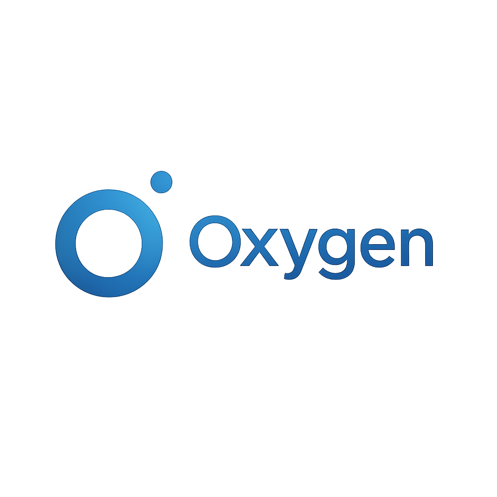

<p align="center">
  
</p>

**Oxygen** is a lightweight scripting language interpreter being built with Rust. Inspired by languages like C, Rust, and potentially others, it aims to provide a simple syntax for scripting tasks.


---

## Table of Contents

- [Introduction](#introduction)
- [Project Status](#project-status)
- [Key Features (Current & Planned)](#key-features-current--planned)
- [Language Overview (Current)](#language-overview-current)
  - [Variables](#variables)
  - [Functions & Control Flow](#functions--control-flow)
  - [Data Types & Literals](#data-types--literals)
  - [Operators](#operators)
  - [Built-in Functions](#built-in-functions)
- [Example Code](#example-code)
  - [Hello World](#hello-world)
  - [Fibonacci Sequence](#fibonacci-sequence)
- [Getting Started](#getting-started)
- [Project Structure](#project-structure)
- [Contributing](#contributing)
- [License](#license)

---

## Introduction

Oxygen is a scripting language interpreter written in Rust, focusing on simplicity and a potentially familiar syntax. The goal is to create an expressive language suitable for various scripting needs.

---

## Project Status

**Early Development:** Oxygen is currently in the early stages of development. The core parsing and interpretation logic is functional, supporting basic language features. Many features are still planned or under development. Expect breaking changes and evolving syntax.

---

## Key Features (Current & Planned)

**Current:**

- **Rust-Powered:** Interpreter built in Rust for performance and safety.
- **Basic Types:** Supports integers (`int`), floating-point numbers (`float`), strings (`string`), booleans (`bool`), and `null`.
- **Core Constructs:**
    - Variable declaration (`let`).
    - Function definition (`fn`) and calls (including recursion).
    - Conditional execution (`if`/`elif`/`else`).
    - Basic arithmetic (`+`, `-`, `*`, `/`) and comparison (`>`, `<`, `>=`, `<=`, `==`, `!=`) operators.
    - Logical operators (`&&`, `||`, `!`).
    - String concatenation (`+`).
    - Basic `print` function.
- **Basic Type Checking:** Prevents invalid operations (e.g., adding a string to an integer).

**Planned:**

- Full type enforcement based on annotations.
- Loops (`for`, `while`).
- More comprehensive standard library.
- Data structures (lists, dictionaries/maps).
- Structs/Objects.
- Modules/Imports.
- Improved error reporting.
- Variable reassignment within all scopes.

---

## Language Overview (Current)

### Variables

Declare variables using `let`. Type annotations (e.g., `let count: int = 10;`) are parsed but **not currently enforced** by the interpreter. Initializers are required.

```oxygen
let count = 10;
let message = "Hello";
let is_active = true;
let price = 99.9;
let maybe_value = null; // Null value
```

### Functions & Control Flow

Define functions with the `fn` keyword. Parameters don't require type annotations currently. `return` statements are used to return values. Basic `if`/`elif`/`else` control flow is supported. Recursion is possible.

```rust
// Function definition
fn greet(name) {
    print("Hello, " + name + "!");
}

// Function call
greet("Oxygen User");

// Conditional execution
let value = -5;
if (value > 0) {
    print("Value is positive.");
} elif (value == 0) {
    print("Value is zero.");
} else {
    print("Value is negative.");
}

// Return value from function
fn add(a, b) {
    return a + b;
}
let sum = add(5, 3);
print("Sum:", sum); // Output: Sum: 8
```

### Data Types & Literals

- **Integers:** `42`, `-10` (represented as `i64`)
- **Floats:** `3.14`, `-0.5` (represented as `f64`)
- **Strings:** `"Hello"`, `"Multi word"` (double quotes required)
- **Booleans:** `true`, `false`
- **Null:** `null`

### Operators

- **Arithmetic:** `+`, `-`, `*`, `/` (Note: integer division truncates)
- **Comparison:** `>`, `<`, `>=`, `<=`, `==`, `!=`
- **Logical:** `&&` (AND), `||` (OR), `!` (NOT)
- **String Concatenation:** `+`
- **Unary Minus:** `-` (e.g., `-5`)

### Built-in Functions

- `print(...)`: Prints its arguments to the console, separated by spaces, followed by a newline. Accepts multiple arguments.

---

## Example Code

### Hello World

A minimal example.

```rust
// sample/helloworld.oxy
print("Hello, World from Oxygen!");
```

### Fibonacci Sequence

This example demonstrates recursive function calls and arithmetic.

```rust
// sample/fibonacci.oxy
print("Calculating Fibonacci numbers recursively");

// Recursive Fibonacci implementation
fn fib(n) {
    if (n <= 0) {
        return 0;
    }
    if (n == 1) {
        return 1;
    }
    // Recursive step relies on '+' operator for numbers
    return fib(n - 1) + fib(n - 2);
}

// Print some Fibonacci numbers
print("Fibonacci(0):", fib(0)); // Expected: 0
print("Fibonacci(1):", fib(1)); // Expected: 1
print("Fibonacci(5):", fib(5)); // Expected: 5
print("Fibonacci(7):", fib(7)); // Expected: 13

// Note: High numbers might be slow due to the naive recursive approach
// and potential interpreter overhead or lack of tail call optimization.
// print("Fibonacci(35):", fib(35));
```

---

## Getting Started

1.  **Prerequisites:** Ensure you have Rust and Cargo installed (see [rustup.rs](https://rustup.rs/)).
2.  **Clone the Repository:**
    ```bash
    # Replace with your actual repository URL if different
    git clone https://github.com/SkuldNorniern/oxygen.git
    cd oxygen
    ```
3.  **Build the Interpreter:**
    ```bash
    cargo build
    ```
    The executable will be located at `target/debug/oxygen`. You can use `cargo build --release` for an optimized build (executable at `target/release/oxygen`).
4.  **Run an Example Script:**
    ```bash
    # Using the debug build
    ./target/debug/oxygen sample/helloworld.oxy
    ./target/debug/oxygen sample/fibonacci.oxy
    ```
    ```bash
    # Using the release build
    ./target/release/oxygen sample/helloworld.oxy
    ```
5.  **Run Embedded Example:**
    If run without a file argument, it executes a built-in example script defined in `src/main.rs`.
    ```bash
    ./target/debug/oxygen
    ```

---

## Project Structure

The codebase is organized as follows:

- `src/`: Contains the core Rust source code.
  - `main.rs`: Entry point, handles argument parsing and orchestrates the execution flow.
  - `lexer/`: Contains modules related to lexical analysis and parsing.
    - `tokenizer.rs`: Converts source code string into a stream of tokens.
    - `token/`: Defines the different types of tokens (`Keyword`, `Operator`, etc.).
    - `parser.rs`: Consumes tokens and builds an Abstract Syntax Tree (AST).
    - `astgen/`: Defines the structure of the AST nodes (`Expression`, `Statement`, etc.).
  - `interpret.rs`: Contains the interpreter logic, which walks the AST and executes the code.
- `sample/`: Contains example Oxygen scripts (`.oxy` files).
- `assets/`: Contains assets like the logo.
- `Cargo.toml`: Defines project dependencies and metadata.
- `README.md`: This file.

---

## Contributing

Contributions are welcome! Feel free to open issues for bugs or feature requests, or submit pull requests. (Consider adding a `CONTRIBUTING.md` file with more specific guidelines later).

---

## License

This project is intended to be open source. Please add a `LICENSE` file (e.g., MIT or Apache 2.0) to formalize this.

---

> *Oxygen: Breathing life into scripts.*